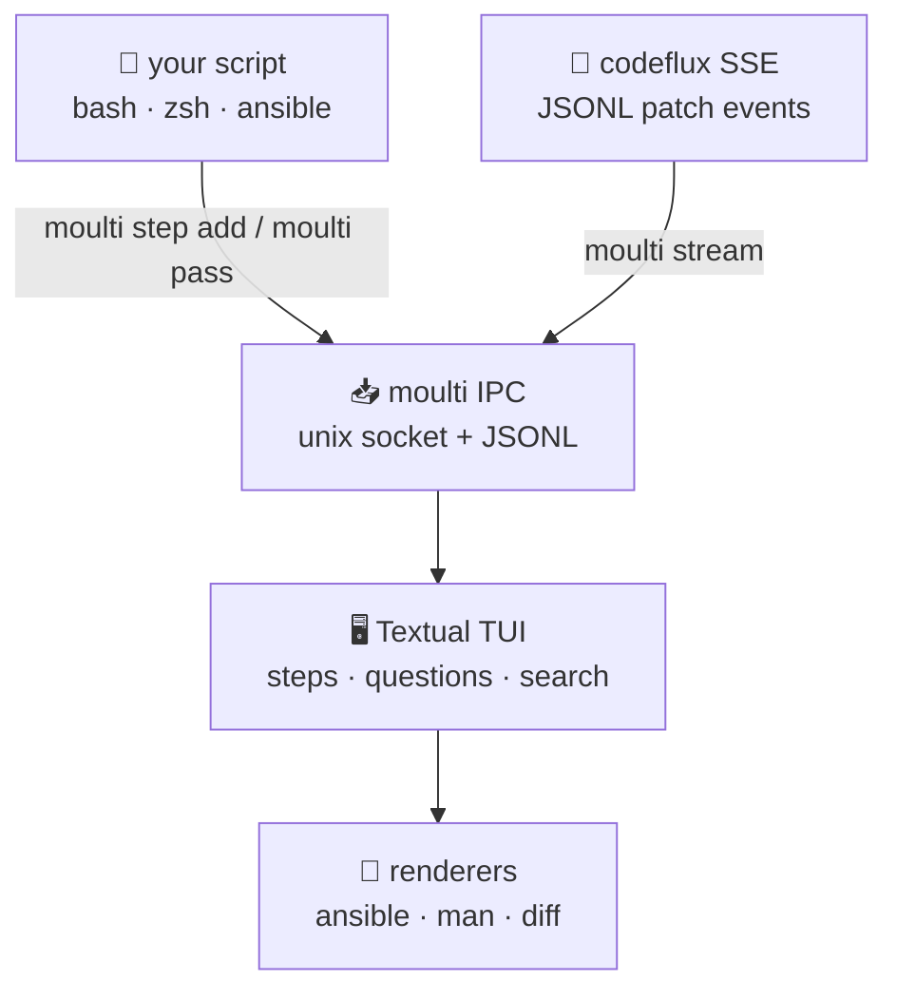
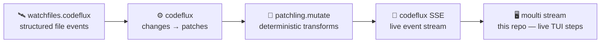

<div align="right">

[](https://github.com/toxicwind/codeflux-moulti)
[](https://pypi.org/project/moulti/)
[](https://github.com/toxicwind/codeflux-moulti/blob/main/LICENSE)
[](https://www.python.org/)
[](https://github.com/toxicwind/codeflux)

</div>

# MOULTI

### Your shell scripts, rendered as a living dashboard.

**Moulti changes the way your shell scripts display their output in the terminal.** Instead of scrolling a wall of text while your script runs, Moulti lets you assign output to **steps** — visual, collapsible blocks with their own title and color. If you've ever scrolled up mid-script to check whether everything went fine, Moulti is made for you.

> 🧬 **toxicwind fork** — this is our working fork of [xavierog/moulti](https://github.com/xavierog/moulti), extended with a **`moulti stream` subcommand** that ingests JSONL patch events into live steps. It is the TUI stage of the [codeflux](https://github.com/toxicwind/codeflux) live patch-streaming pipeline: file changes become structured patches, patches become SSE events, events become living steps.

Here is what [upgrading a Debian system](examples/moulti-debian-upgrade.bash) looks like with Moulti:


Interested? [Run this demo in a container using docker or podman](https://hub.docker.com/r/xavierong/moulti-demo)

Not convinced yet? What if the output of your Ansible playbooks looked like this?


---

## ✨ Features

- **Steps** — collapsible, titled, colored blocks your scripts fill with output
- **Questions** — scripts can ask the user things mid-run: free-text input or button choices

  
  

- **`moulti stream`** *(fork addition)* — ingest JSONL patch events into live steps, the rendering stage of the codeflux pipeline
- **Text search** — search step output like `less`: [docs](https://moulti.run/text-search/)
- **Zoom** — maximize a single step log, tmux-zoom style
- **Progress bars** — [docs](https://moulti.run/progressbar/)
- **Programmatic scrolling** — [docs](https://moulti.run/scrolling/#programmatically-scrolling-through-steps)
- **`moulti-askpass`** — askpass helper (e.g. for SSH): [docs](https://moulti.run/shell-scripting/#ssh)
- **Native renderers** — [Ansible playbooks](https://moulti.run/ansible/), [man pages](https://moulti.run/manpage/), [unified diffs](https://moulti.run/diff/) (colors via [delta](https://github.com/dandavison/delta))

  
  

---

## 🚀 Quick start

```bash
# 1. install
pipx install moulti; pipx ensurepath

# 2. start an instance, add a step, fill it
moulti init
moulti step add build --title='Building the thing'
make 2>&1 | moulti pass build

# 3. (codeflux) stream live patch events into steps
python -m codeflux tui --port 8765
```

Full synopsis: `moulti init` → `moulti step add <name> --title='...'` → `whatever | moulti pass <name>` → repeat. More in the [Documentation](https://moulti.run/).

---

## 🔧 Architecture



Moulti is written in Python on [Textual](https://textual.textualize.io/), with [Pyperclip](https://pypi.org/project/pyperclip/), [argcomplete](https://kislyuk.github.io/argcomplete/) and [unidiff](https://github.com/matiasb/python-unidiff/). Scripts drive the TUI through a Unix-socket IPC; the fork's `stream` subcommand (`src/moulti/streaming.py`) adds a JSONL event ingestion path on top of that same IPC.

### Inspiration

The idea of driving TUI elements from scripts comes from [dialog](https://invisible-island.net/dialog/dialog-figures.html) and [whiptail](https://whiptail.readthedocs.io/en/latest/index.html). The closest prior art is probably [multiplex](https://github.com/dankilman/multiplex) — deemed unsatisfying on architecture, which prompted Moulti's development.

---

## ⚙️ Config

Look and feel is fully customizable:

| Knob | What it does |
|---|---|
| `moulti set` | step flow direction (up/down) and position — [docs](https://moulti.run/direction-and-position/) |
| [Textual CSS (TCSS)](https://textual.textualize.io/guide/CSS/) | full styling control — [docs](https://moulti.run/classes/#custom-classes) |
| `MOULTI_ANSI` | ANSI themes — [docs](https://moulti.run/environment-variables/#moulti_ansi) |

Optional services: none. Moulti is local-only — one terminal, one IPC socket, no daemons, no accounts.

---

## 🛠️ Dev

```bash
pip install -e .            # editable install
pytest tests/               # test suite
```

See [Documentation.md](Documentation.md) and the [online docs](https://moulti.run/) for the full manual. Contributions welcome — PRs against this fork land here on `main`; upstream-worthy changes can be proposed to [xavierog/moulti](https://github.com/xavierog/moulti) too.

---

## 🧬 The codeflux family



| Repo | Role |
|---|---|
| [**codeflux**](https://github.com/toxicwind/codeflux) | the live streaming pipeline |
| [**codeflux-moulti**](https://github.com/toxicwind/codeflux-moulti) | TUI steps + `stream` subcommand (this repo) |
| [**codeflux-patchling**](https://github.com/toxicwind/codeflux-patchling) | deterministic mutation backend |
| [**codeflux-python-patch**](https://github.com/toxicwind/codeflux-python-patch) | hunks-as-data + apply reports |
| [**codeflux-watchfiles**](https://github.com/toxicwind/codeflux-watchfiles) | structured file events |

---

## 📄 License & security

**License:** [MIT](LICENSE) — © 2024-2025 Xavier G. Forked with gratitude; fork additions © toxicwind under the same terms.

**Security:** Moulti runs locally and never touches the network. Report issues privately via GitHub Security Advisories on this repo.
